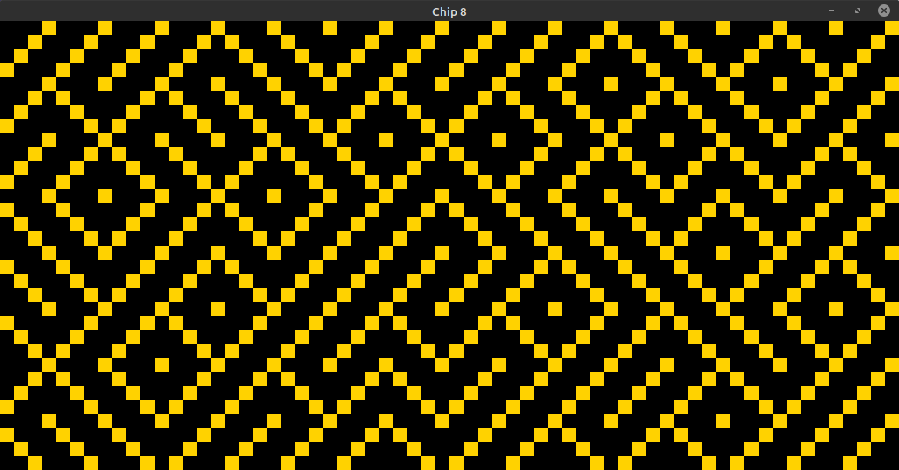

# Chip8 Emulator

This is my attempt at building an emulator for chip8 as a learning project for Rust.
This project was done during two weekends whilst trying to get familiar with the new language.
As the project mainly helped practice the language, I'm still unsure whether I'm going to finish it. 
The project is written in Rust and uses Sdl as a GUI (for cross-platform support)



## Requirements
1. libsdl
2. Rust

The project was only tested on Linux Mint but should work properly on all platforms.

## How to run
```bash
cargo run <path_to_rom>
```


## Known Bugs

Currently there are quite a lot of bugs in the emulator
- [ ] One of the equality opcodes is currupted, can be seen when playing pong (the ball bounces from the wall)

## Possible future features
- [ ] Sound Driver
- [ ] Changing the GUI to WebAssembly using Yew

## Resources

These are the resources used in order to develop the project:
- https://doc.rust-lang.org/book/ - for learning Rust on the way
- http://devernay.free.fr/hacks/chip8/C8TECH10.HTM - great technical reference for chip8
- https://github.com/dmatlack/chip8/tree/master/roms/games - Lots of useful Roms to test the emulator with
